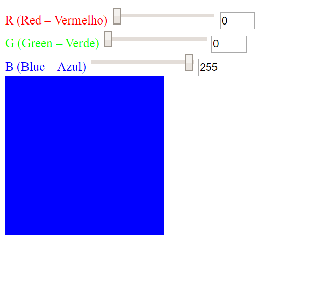

# RGB Color Picker

This project was made to show what I have learned of pure HTML, CSS and JavaScript.

## Summary

* [Requirements](#requirements)
* [Current State](#current-state)

# Requirements
1. Made with pure HTML, CSS and JavaScript
2. Must have three inputs (range: 0-255)
3. The inputs must represent the colors Red, Green and Blue
4. The values of the three inputs must be shown as an RGB color (choose freely where to show it)
5. One __readonly__ input next to each RGB input that displays its value
6. When the user modifies the value of the input it should reflect the change in the location chosen on (4)

# Current State

